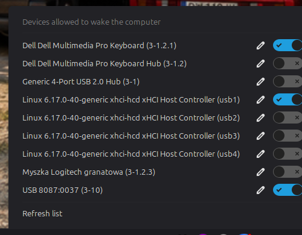
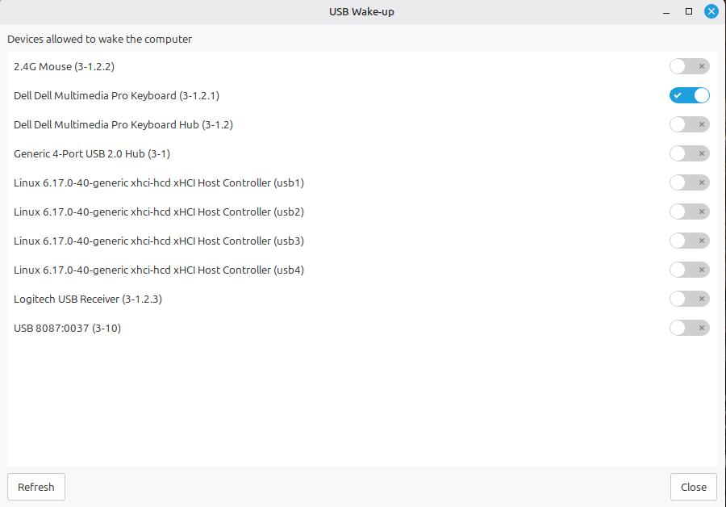
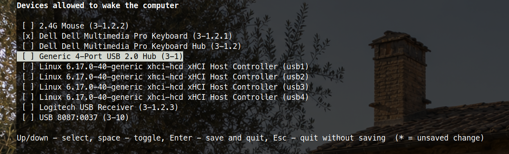

# USB Wake-up

A Cinnamon 6.x applet (tested on Linux Mint 22, Cinnamon 6.6) that lists your
USB devices and lets you choose which of them are allowed to wake the
computer from sleep. Includes a standalone CLI/GUI tool for the same task,
usable from a terminal or the application menu.

### Panel applet



### GTK window



### Text menu



## Features

- Panel applet: click the icon, toggle switches per device.
- Rename devices: click the pencil icon next to a device (in the panel
  applet or the GTK window) to give it a friendlier name, edited inline.
  Custom names are stored in `~/.config/usb-wakeup/labels.json`, keyed by
  USB vendor:product id, and are shared across the applet, GTK window, text
  menu, and `usb-wakeup list`.
- Standalone tool (`usb-wakeup`):
  - no arguments: interactive text menu with arrow-key navigation
    (curses-based)
  - `usb-wakeup gui`: GTK window, also reachable from the Cinnamon menu
  - `usb-wakeup list`, `usb-wakeup enable <id>`, `usb-wakeup disable <id>`:
    scriptable, non-interactive
- Settings persist across reboots: changes are written to
  `/etc/usb-wakeup/config` and reapplied by a udev rule whenever a device is
  plugged in (including at boot).
- UI language follows the system locale (Polish if `pl*`, English
  otherwise).
- Privileged writes go through a single, narrowly-scoped helper script
  invoked via `pkexec`, with a Polkit rule so you're not prompted on every
  toggle within a session.

## How it works

Linux exposes wake-up support for each USB device as
`/sys/bus/usb/devices/<id>/power/wakeup`, writable only by root. This
project provides:

- `usb-wakeup@jkatnik/` — the Cinnamon applet (GJS/Cinnamon JS).
- `bin/usb-wakeup` — a Python 3 + GTK3 tool with both a text (curses) and a
  graphical interface.
- `helper/usb-wakeup-helper.sh` — the only piece that runs as root (via
  `pkexec`). It validates the device id, writes the sysfs attribute, and
  persists the choice (keyed by USB vendor:product id) to
  `/etc/usb-wakeup/config`.
- `udev/` — a udev rule + script that reapplies the saved setting whenever a
  matching device is added (including during boot's coldplug pass), since
  the sysfs value itself does *not* survive a reboot.
- `polkit/` — a Polkit action definition so `pkexec` only asks for
  authorization for this specific helper script.

All entry points (applet, GUI, text menu, CLI flags) call the same helper
script, so a change made in any of them is persisted and reflected
everywhere else.

## Requirements

- Linux Mint 22 / Cinnamon 6.x (uses `PopupMenuSection` and other modern
  Cinnamon JS APIs)
- Python 3 with PyGObject (GTK 3) — `python3-gi`, `gir1.2-gtk-3.0`
- `polkit` (`pkexec`) — installed by default on Mint

## Installation

One-liner (downloads the repo to a temp dir and runs `install.sh` from
there):

```bash
curl -fsSL https://raw.githubusercontent.com/jkatnik/usb-wakeup/master/install.sh | bash
```

Or clone it yourself:

```bash
git clone https://github.com/jkatnik/usb-wakeup.git
cd usb-wakeup
./install.sh
```

Run it as your normal user (**not** with `sudo ./install.sh` or `sudo
bash -c "curl ... | bash"`) — the script escalates only the specific steps
that need root (`sudo`) and installs the rest into your own
`~/.local/share`. It also works if you do prefix it with `sudo`; it detects
the real user via `$SUDO_USER` either way. `sudo` will prompt for your
password on the terminal during the run either way.

After installing:

- **Applet**: right-click the panel → *Applets*, find "USB Wake-up" and
  enable it. If it doesn't show up immediately, restart Cinnamon
  (`Alt+F2`, type `r`, Enter).
- **Application menu**: look for "USB Wake-up" — opens the GTK window.
- **Terminal**:
  ```
  usb-wakeup            # interactive text menu
  usb-wakeup gui        # GTK window
  usb-wakeup list       # print devices and exit
  usb-wakeup enable 3-1.2.1
  usb-wakeup disable 3-1.2.1
  ```

### Text menu controls

Up/Down to move, Space to toggle a device (marked with `*` until saved),
Enter to save all changes and exit, Esc to exit without saving.

## Uninstalling

```bash
rm -rf ~/.local/share/cinnamon/applets/usb-wakeup@jkatnik
rm -f ~/.local/share/applications/usb-wakeup.desktop
sudo rm -f /usr/local/bin/usb-wakeup /usr/local/bin/usb-wakeup-helper.sh /usr/local/bin/usb-wakeup-apply.sh
sudo rm -f /usr/share/polkit-1/actions/org.cinnamon.applets.usbwakeup.policy
sudo rm -f /etc/udev/rules.d/99-usb-wakeup.rules
sudo rm -rf /etc/usb-wakeup
sudo udevadm control --reload-rules
```

## Security notes

- The only component that runs as root is `usb-wakeup-helper.sh`, launched
  through `pkexec` (never invoked directly, and Polkit's
  `org.freedesktop.policykit.exec.path` annotation pins it to that exact
  binary path).
- It only accepts a device id matching `[A-Za-z0-9._-]+` (no path
  traversal) and an action of `enabled`/`disabled`, resolves the target
  path with `readlink -f`, and refuses to write anywhere outside
  `/sys/devices/*/power/wakeup`.
- The udev-triggered script (`usb-wakeup-apply.sh`) never talks to
  `pkexec`; it runs as root only because udev itself does, and only reads
  `/etc/usb-wakeup/config` (root-owned, `0644`) plus sysfs attributes of the
  device that was just plugged in.

## License

MIT — see [LICENSE](LICENSE).
